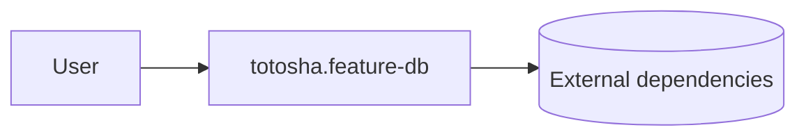

C4 L1 - System Context
======================

Purpose
-------

This document describes the system in its environment: primary users and external systems it depends on.

Diagram
-------

Notes
-----

- Keep this diagram stable and high-level.
- Do not include internal containers here; those belong to C4 L2.
