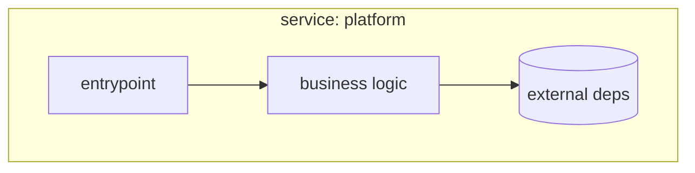

C4 L3 - Components (Service: platform)
============================================

Purpose
-------

This document describes the internal component view of the `platform` service.

Diagram
-------

Notes
-----

- Keep names stable and implementation-neutral.
- Use this view to document boundaries, not every file.
